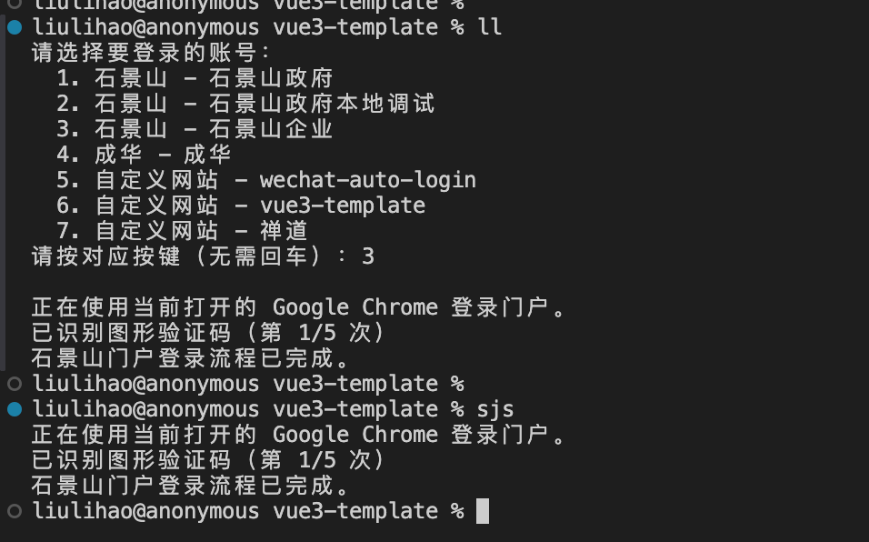

# Portal Dev：自动登录门户，打开本地联调页面

Portal Dev 是一个命令行工具。把账号配置一次，以后输入 `portal-dev login` 就能选择账号，自动打开浏览器并登录石景山、成华门户或自定义网站。开发石景山智能体页面时，还能自动进入样板间，把门户 Token 带到本地页面。



## 我需要哪种用法？

| 你的目标             | 运行命令                              | 工具会做什么                                                         |
| -------------------- | ------------------------------------- | -------------------------------------------------------------------- |
| 登录某个已配置账号   | `portal-dev login`                    | 列出账号，按数字或字母选择后自动登录                                 |
| 直接登录指定账号     | `portal-dev sjs`                      | 运行该账号设置的快捷别名，跳过选择菜单                               |
| 联调石景山智能体页面 | `portal-dev dev`                      | 登录门户、进入样板间、取得 Token，并打开本地页面；需要时启动前端服务 |
| 登录自己的业务系统   | `portal-dev --portal custom 账号名称` | 打开配置的登录页，填写账号密码；可按需识别图形验证码                 |

`portal-dev dev` 默认使用当前前端项目；项目在别处时使用 `portal-dev dev --project /你的/项目路径`。本地页面默认是 `http://localhost:5173`。如果已经为石景山账号配置了 `mode: "dev"` 和别名，也可以直接运行该别名。

## 第一次使用

需要 Node.js 18+ 和 Google Chrome 或 Microsoft Edge。全局安装后，运行配置向导：

```bash
npm install -g @sybz-components/portal-dev
portal-dev config
```

向导会让你选择门户、填写账号名称、用户名和密码。石景山账号可以选“只登录”或“本地联调”；自定义网站需要填写登录页 URL，并选择是否有图形验证码。可以为常用账号设置别名，例如 `sjs`。

配置好后，从任意目录运行：

```bash
portal-dev login
```

也可以运行 `portal-dev open` 打开配置文件，直接编辑账号和联调参数。安装时会创建配置文件，已有配置不会被覆盖。

## 自定义网站的 `code`：是否识别图形验证码

`code` 是 **自定义网站账号** 的配置属性，不是命令行参数。它决定自动登录时是否查找、识别并填写图形验证码；石景山和成华门户的登录流程不靠这个属性切换。

| `code` 值              | 行为                                                                                |
| ---------------------- | ----------------------------------------------------------------------------------- |
| 省略或 `false`（默认） | 填写用户名和密码后提交，适合没有图形验证码的登录页                                  |
| `true`                 | 查找可见的验证码图片和输入框，识别验证码后连同账号密码一起提交；失败时最多尝试 5 次 |

例如，你的业务系统登录页有图形验证码，可以在 `portal-dev open` 打开的配置文件中添加这个账号：

```json
{
  "version": 15,
  "profiles": {
    "custom": [
      {
        "name": "我的业务系统",
        "loginUrl": "https://example.com/login",
        "username": "my-account",
        "password": "my-password",
        "code": true,
        "alias": "my-system"
      }
    ]
  }
}
```

保存后运行 `portal-dev my-system` 即可。没有验证码时，删除 `code` 或设为 `false`。也可以运行 `portal-dev config --portal custom`，在“登录时是否需要图形验证码？”处输入 `y`；直接回车表示不识别。当前识别适用于常见的 `captcha`、`verify`、`code` 命名或“验证码”标签，以及 3–8 位英数字图形码；特殊页面可能需要单独适配。

## 石景山本地联调怎么走

1. 运行 `portal-dev config --portal sjs`，将模式选为“本地联调”。按需填写项目路径、本地地址和样板间信息。
2. 运行设置好的别名，或在当前项目目录运行 `portal-dev dev`。
3. 工具登录石景山门户，进入智能体样板间，从匹配的 iframe 地址取得 Token，携带查询参数打开本地页面。本地服务尚未启动时，会启动当前项目或 `project` 指定项目的开发服务。

如果前端服务已经启动，可以不填 `project`。默认本地地址为 `http://localhost:5173`，接收 Token 的路由可在配置向导中设置。

## 完整配置示例

下面的配置同时包含石景山只登录、本地联调、成华登录和自定义网站登录。其中最后一个自定义网站账号开启了 `code` 图形验证码识别。当前配置文件版本为 `5`。

```json
{
  "version": 5,
  "profiles": {
    "sjs": [
      {
        "name": "石景山政府",
        "username": "testuser_gov",
        "password": "xxx",
        "alias": "sjs"
      },
      {
        "name": "石景山政府本地调试",
        "username": "testuser_gov",
        "password": "xxx",
        "alias": "sjs2",
        "mode": "dev"
      },
      {
        "name": "石景山企业",
        "username": "testuser_company",
        "password": "xxx"
      }
    ],
    "chenghua": [
      {
        "name": "成华",
        "username": "agentuser001",
        "password": "xxx",
        "alias": "ch",
        "mode": "login"
      }
    ],
    "custom": [
      {
        "name": "wechat-auto-login",
        "username": "admin",
        "password": "xxx",
        "loginUrl": "https://helix-ai-op.comlan.com/portal/wechat-auto"
      },
      {
        "name": "禅道",
        "username": "llh",
        "password": "xxx",
        "loginUrl": "https://helix-ai-minio.comlan.com/zentao/"
      },
      {
        "name": "石景山政府custom",
        "username": "xxx",
        "password": "xxx",
        "loginUrl": "http://115.190.54.111:1880/passport/login/userLogin",
        "code": true
      }
    ]
  }
}
```

## 账号选择与常用命令

`portal-dev login` 会列出石景山、成华和自定义网站的账号。前 9 项按 `1-9`，第 10–35 项按 `A-Z`，无需回车；账号超过 35 个或终端不支持单键输入时，输入完整序号并回车。

```bash
portal-dev login 1                 # 直接运行列表中第 1 个账号
portal-dev login 10                # 直接运行第 10 个账号
portal-dev --portal chenghua 成华账号 # 按名称登录成华账号
portal-dev config --portal custom  # 新增或更新自定义网站账号
portal-dev open                    # 打开配置文件
portal-dev --help                  # 查看全部参数和默认值
```

## 常见问题

### 提示缺少账号密码

运行 `portal-dev config` 填写账号，或运行 `portal-dev open` 检查配置文件，然后重新执行命令。

### 找不到 Chrome 或 Edge

安装 Google Chrome 或 Microsoft Edge 后重新运行。

### 本地服务启动超时

确认业务项目存在 `dev` script，并检查配置的本地地址和端口；默认端口是 `5173`。

### 验证码识别失败

工具最多尝试 5 次。连续失败时检查验证码图片、输入框和登录按钮是否使用常见结构；二维码、滑块等验证方式需要单独适配。

## 进一步使用

Portal Dev 以独立 npm 包发布，不增加 `sybz-components` 组件主包的浏览器端体积。macOS 优先复用当前 Chrome；Windows 和 Linux 也支持浏览器自动化。

运行 `portal-dev skill install` 后，可以在 Codex 中说“使用 portal-dev 启动当前项目的石景山门户联调”。运行 `portal-dev --help` 可查看完整命令、参数和默认值。

如果想把常用命令缩短成 `ch`、`sjs` 等，可查看 [alias 用法说明](/components/alias/home.md)。
